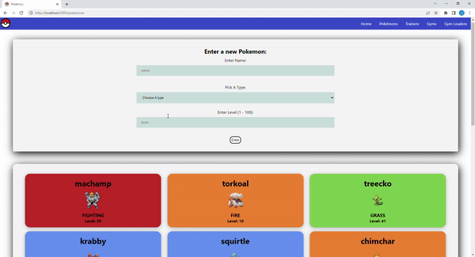
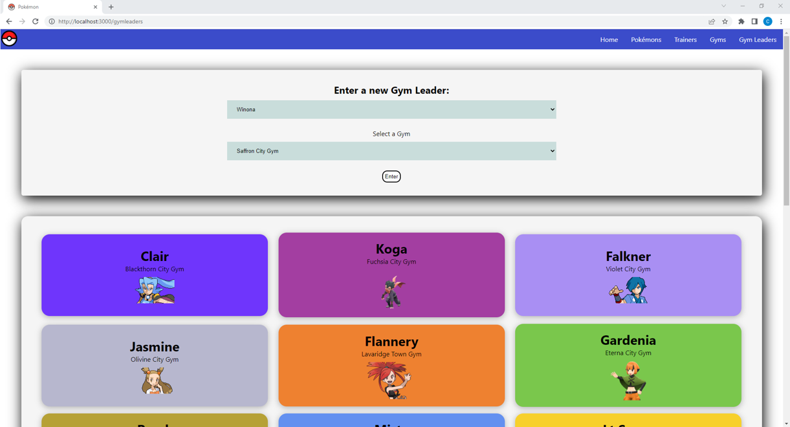
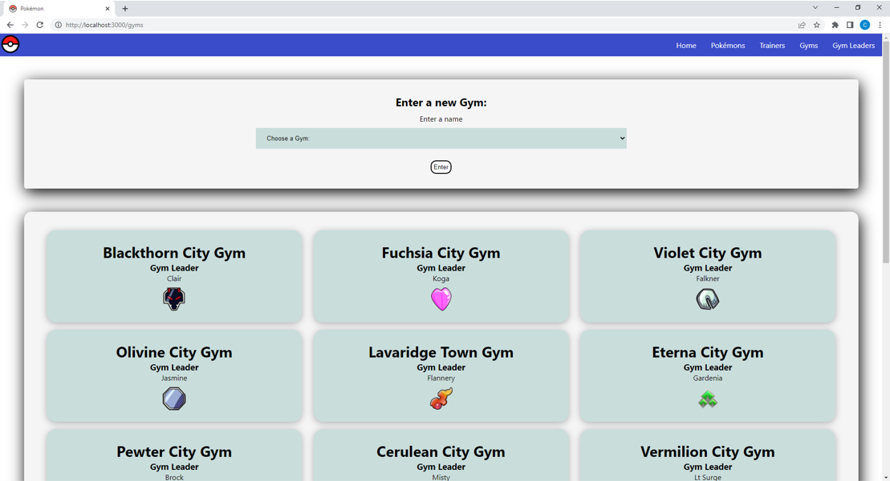

# Catch (Pokémon API):

We are Pokemon trainers, a team consisting of [BNTA](https://techacademy.brightnetwork.co.uk/) Cohort 5 members : [James](https://github.com/jamesdpli), [Aisha](https://github.com/aisha-png), [Jack](https://github.com/Jwells1397), [Adan](https://github.com/AdanAbdillahi)
# Table of Contents
- [Webiste showcase](website-showcase)
- [Summary](#summary)
- [Step-by- step instructions for inital set-up](#step-by-step-instructions-for-initial-set-up)
- [Wireframe](#wireframe)

# Website showcase

# Summary
The original API is from `https://github.com/biancakendall29/w07_server_side_project.git`  
we edited the relationships, methods and data loader struture  
Front end project consisting of a team of 4 as part of the BNTA programme, a week 11 project using an API from a previous groups backend project, where we used react. The website contains a home page, a pokemon page where the user can view and enter pokemon using the CRUD functionality into the database using a react form, and similarly to the pokemon page we have a gym and gymLeader page with the view and enter functionaility also.
# Step-by-step instructions for initial set up
1. Make sure that you have installed Java.
2. Clone this repository : `git@github.com:aisha-png/fontend_POKEMON_project.git` and open in you Java IDE
3. Run the backend API to start the server: `https://localhost:8081`
4. Open this project in VS code.
5. Open a new terminal up, type `npm install`
6. In terminal type `npm start`
## Wireframe

# Acknowledegements
A massive thanks to the [BNTA](https://techacademy.brightnetwork.co.uk/) team, and especially to our trainers [Richard](https://github.com/biancakendall29/w07_server_side_project#summary) and [Anna](https://github.com/biancakendall29/w07_server_side_project#summary)!
